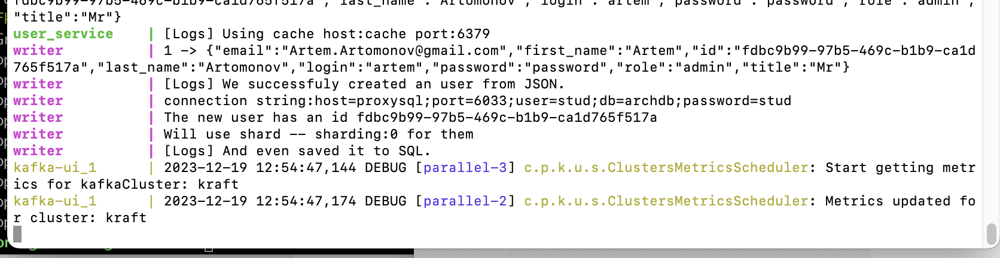

# Лаборатарные работы по Архитектуре информационных систем


## Лабораторная работа №5
Добавила отдельный сервис, который реализует очередь записи в БД. 

По логам можно посмотреть что это действительно работает: 



## Лабораторная работа №4

Был добавлен кэш. 

Чтобы проверить работу кэша и доставать пользователя по id я сначала подготовила список id c помощью python скрипта. 
(так как id у меня не int, а UUID, было бы проблематично сгенерить достаточное количество совпадающих id)

Результаты приведены ниже: 


## Лабораторная работа №3

Сущность User хранится в разных шардах. При создании нового пользователя, генерится его уникальный ID, от него берется хэш функция, и от хэша берется остаток от деления на количество нод бд. Таким образом, можно примерно распределить данные в разные шарды. 

Когда берется список всех пользователей, проходим по всем шардам, и запрашиваем оттуда все данные. 

Пример из логов: 

```
request:/users/register?first_name=Artem&last_name=Artomonov&email=Artem.Artomonov@gmail.com&title=Mr&login=artem&password=password&role=admin
The new user has an id 7c16a4ab-1c13-4bb9-862d-79e0403a18b3
Will use shard -- sharding:1 for them
request:/users/register?first_name=Artem&last_name=Artomonov&email=Artem.Artomonov@gmail.com&title=Mr&login=artem&password=password&role=admin
The new user has an id eb72e8d6-404b-4209-8542-718fbdf42f10
Will use shard -- sharding:0 for them
request:/users/register?first_name=Artem&last_name=Artomonov&email=Artem.Artomonov@gmail.com&title=Mr&login=artem&password=password&role=admin
The new user has an id 0a1d9957-3e80-48b8-b7e2-30a282f3abc6
Will use shard -- sharding:0 for them
request:/users/register?first_name=Artem&last_name=Artomonov&email=Artem.Artomonov@gmail.com&title=Mr&login=artem&password=password&role=admin
The new user has an id a65b6d7f-ef46-4798-83cd-9f7eafcf32e9
Will use shard -- sharding:1 for them
```

## Лабораторная работа №1

### Контекстная диаграмма

  

### Контейнерная диаграмма

  


