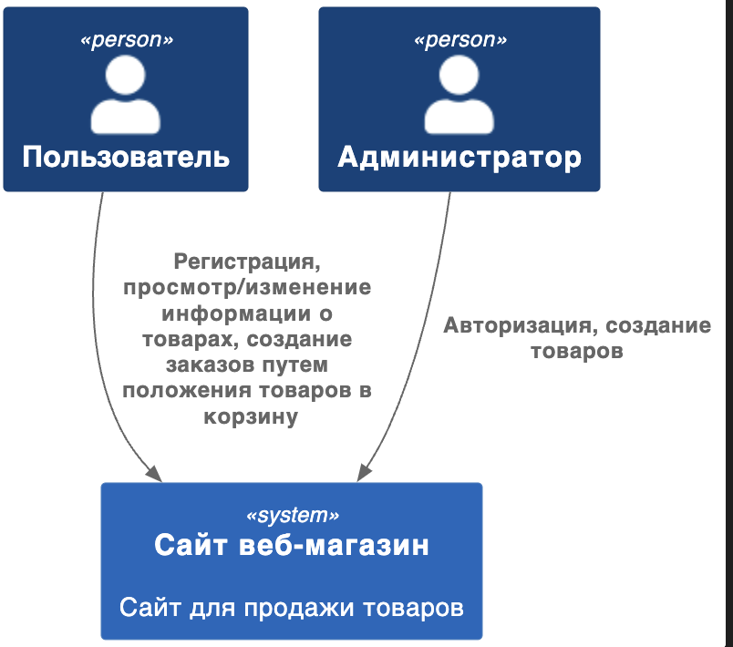
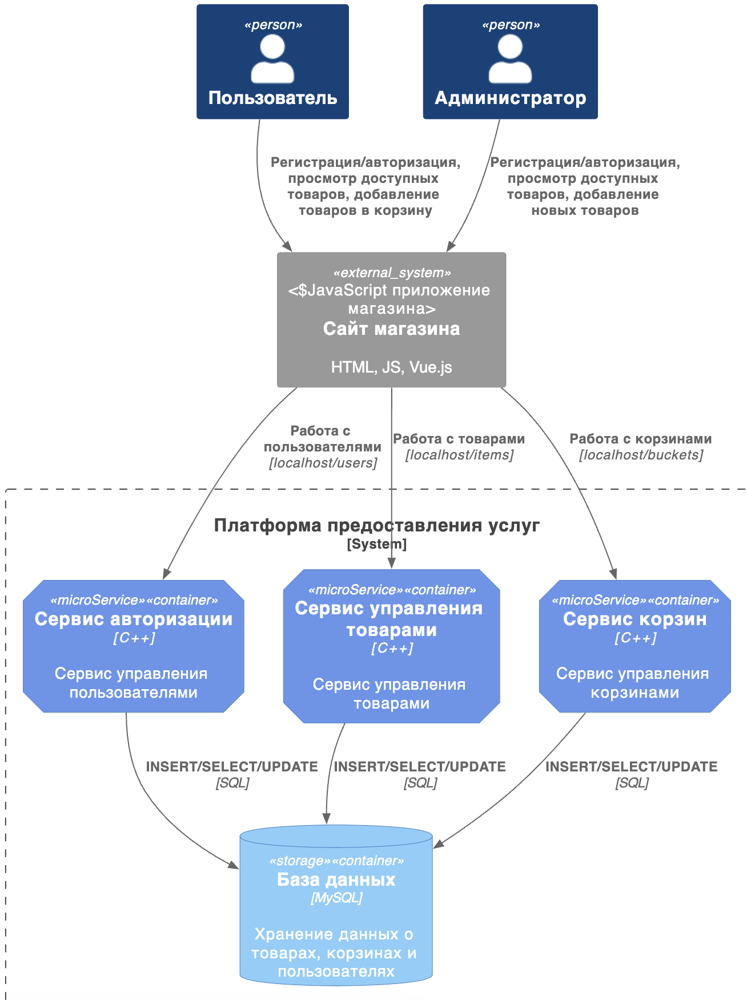

# Лаборатарные работы по Архитектуре информационных систем

## Лабораторная работа №3

Сущность User хранится в разных шардах. При создании нового пользователя, генерится его уникальный ID, от него берется хэш функция, и от хэша берется остаток от деления на количество нод бд. Таким образом, можно примерно распределить данные в разные шарды. 

Когда берется список всех пользователей, проходим по всем шардам, и запрашиваем оттуда все данные. 

## Лабораторная работа №1

### Контекстная диаграмма

  

### Контейнерная диаграмма

  

