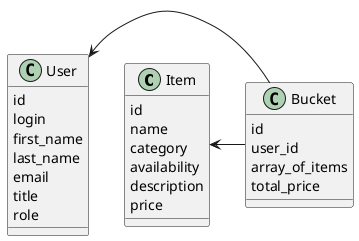

# Компонентная архитектура
<!-- Состав и взаимосвязи компонентов системы между собой и внешними системами с указанием протоколов, ключевые технологии, используемые для реализации компонентов.
Диаграмма контейнеров C4 и текстовое описание. 
-->
## Компонентная диаграмма

```plantuml
@startuml
!include https://raw.githubusercontent.com/plantuml-stdlib/C4-PlantUML/master/C4_Container.puml

AddElementTag("microService", $shape=EightSidedShape(), $bgColor="CornflowerBlue", $fontColor="white", $legendText="microservice")
AddElementTag("storage", $shape=RoundedBoxShape(), $bgColor="lightSkyBlue", $fontColor="white")

Person(user, "Пользователь")
Person(admin, "Администратор")

System_Ext(web_site_app, "Сайт магазина", "HTML, JS, Vue.js", "JavaScript приложение магазина")

System_Boundary(conference_site, "Платформа предоставления услуг") {
  '  Container(web_site_app, "Клиентское web приложение", ")
   Container(users_service, "Сервис авторизации", "C++", "Сервис управления пользователями", $tags = "microService")    
   Container(items_service, "Сервис управления товарами", "C++", "Сервис управления товарами", $tags = "microService") 
   Container(buckets_service, "Сервис корзин", "C++", "Сервис управления корзинами", $tags = "microService")   
   ContainerDb(db, "База данных", "MySQL", "Хранение данных о товарах, корзинах и пользователях", $tags = "storage")
   
}

Rel(user, web_site_app, "Регистрация/авторизация, просмотр доступных товаров, добавление товаров в корзину")
Rel(admin, web_site_app, "Регистрация/авторизация, просмотр доступных товаров, добавление новых товаров")

Rel(web_site_app, users_service, "Работа с пользователями", "localhost/users")
Rel(users_service, db, "INSERT/SELECT/UPDATE", "SQL")

Rel(web_site_app, items_service, "Работа с товарами", "localhost/items")
Rel(items_service, db, "INSERT/SELECT/UPDATE", "SQL")

Rel(web_site_app, buckets_service, "Работа с корзинами", "localhost/buckets")
Rel(buckets_service, db, "INSERT/SELECT/UPDATE", "SQL")

@enduml
```
## Список компонентов  

### Сервис авторизации
**API**:
-	Создание нового пользователя
      - входные параметры: login, пароль, имя, фамилия, email, обращение (г-н/г-жа), роль (администратор или покупатель)
      - выходные параметры: отсутствуют
-	Поиск пользователя по логину
     - входные параметры:  login
     - выходные параметры: имя, фамилия, email, обращение (г-н/г-жа), роль
-	Поиск пользователя по маске имени и фамилии
     - входные параметры: маска фамилии, маска имени
     - выходные параметры: login, имя, фамилия, email, обращение (г-н/г-жа), роль

### Сервис товаров
**API**:
- Создание товара
  - Входные параметры: название товара, категория, аннотация, есть ли на складе или нет, стоимость
  - Выходные параметры: идентификатор товара
- Получение списка всех товаров
  - Входные параметры: отсутствуют
  - Выходные параметры: массив с товарами, где для каждого указаны его идентификатор товара, название товара, категория, аннотация, есть ли на складе или нет, стоимость

### Сервис корзин
**API**:
- Добавление товара в корзину пользователя
  -  Входные параметры: идентификатор товара, идентификатор пользователя
  -  Выходные параметры: отсутстсвуют
- Получение корзины для пользователя
  - Входные параметры: идентификатор пользователя
  - Выходные параметры: массив с товарами в корзине (идентификатор товара, название товара, категория, аннотация, есть ли на складе или нет, стоимость), полная стоимость всей корзины, идентификатор пользователя


### Модель данных
